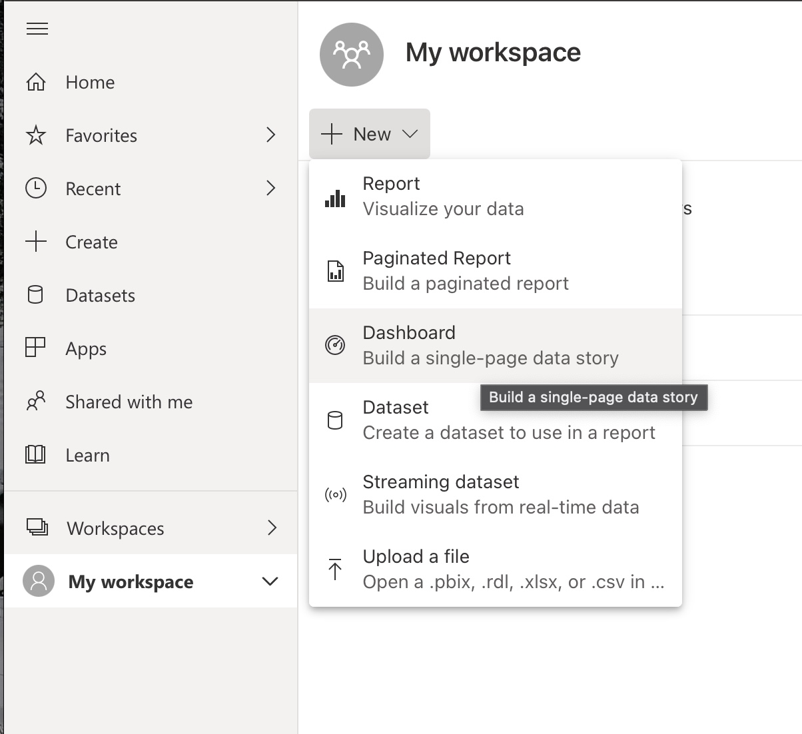
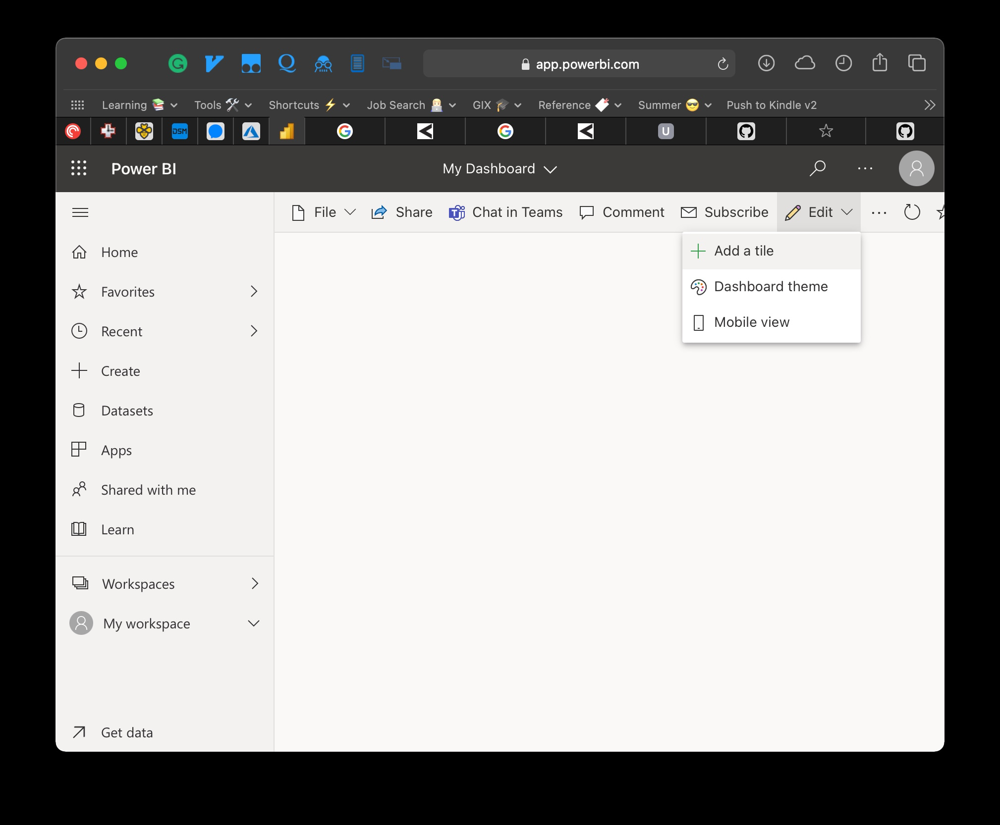
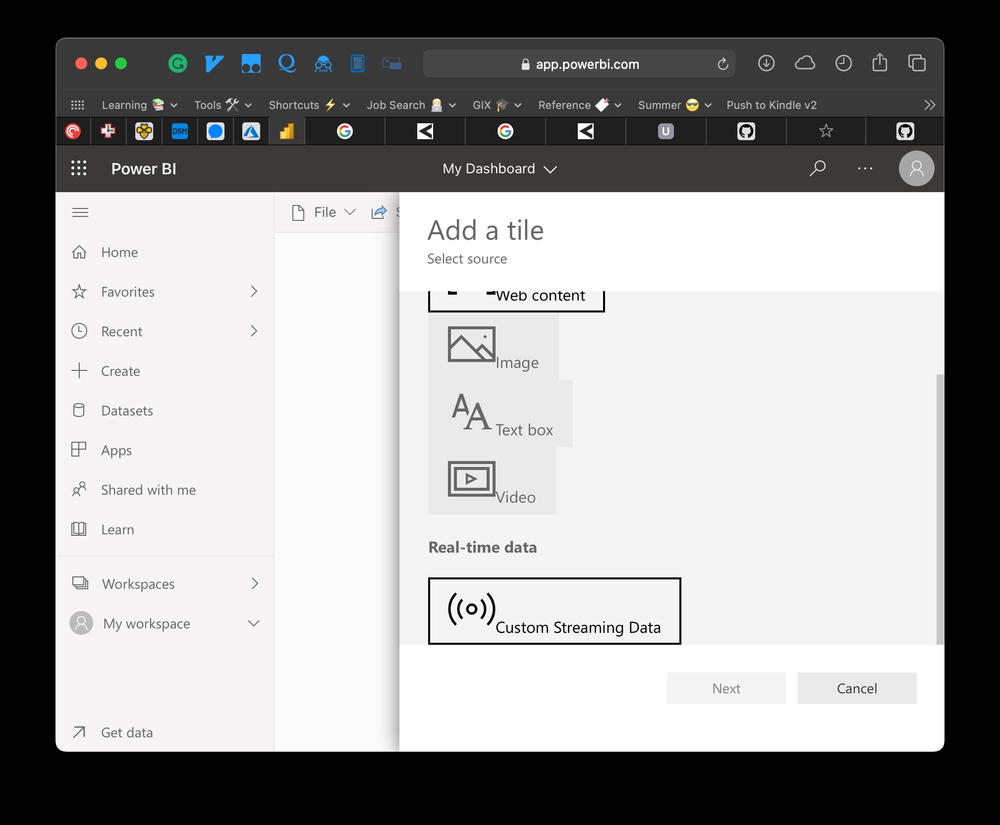
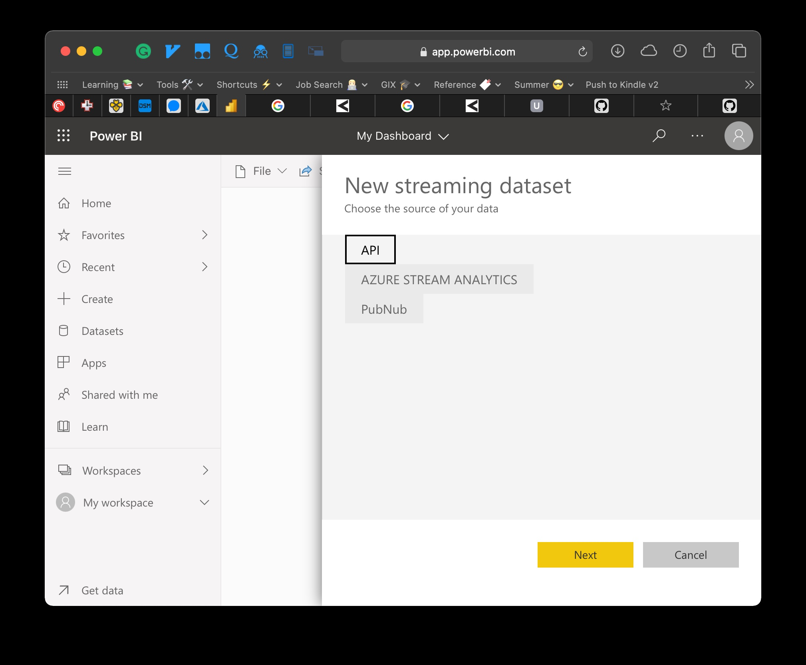
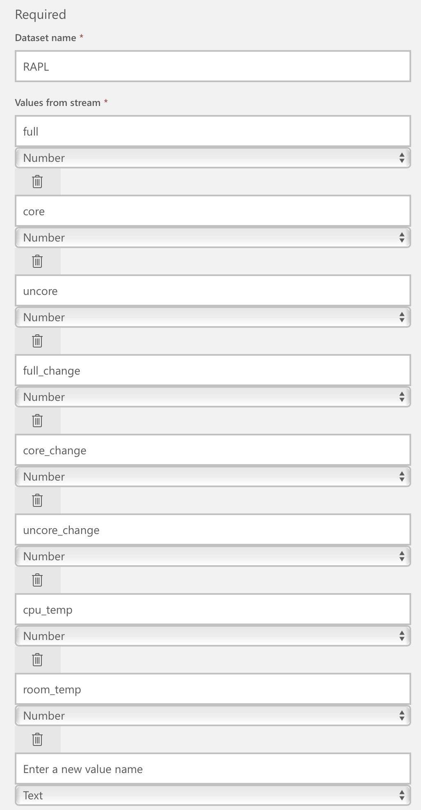
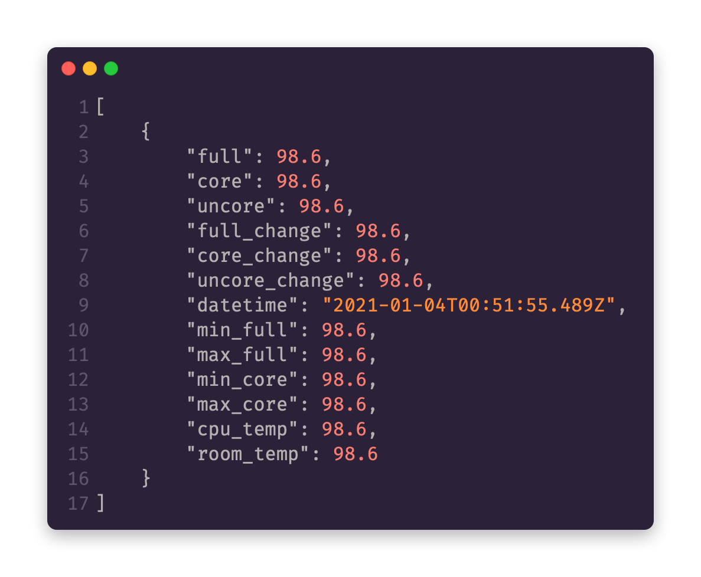
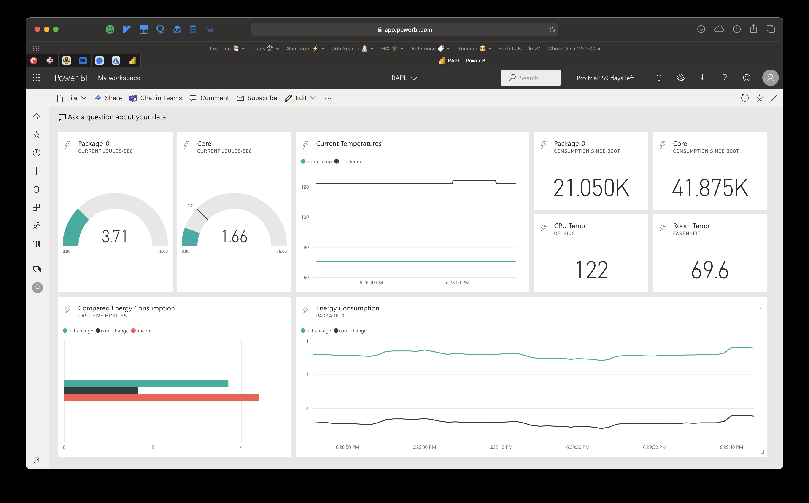

# RAPL-visualize
Visualize real-time RAPL (Running Average Power Limit) usage using Home Assistant (running on Ubuntu Linux) and Microsoft Power BI

## About
RAPL is a feature for Intel-based processors introduced on the Sandy Bridge microarchitecture, which allows for several power-related features. In this case we are using the power metering capabilities, but there are [multiple other features](https://01.org/blogs/2014/running-average-power-limit-%E2%80%93-rapl) that can be realized using RAPL.

The main purpose of this project is to show the real-time capabilities of [Power BI streaming data sets](https://docs.microsoft.com/en-us/power-bi/connect-data/service-real-time-streaming) and how simple it can be to hook into a push data set's REST API using a platform such as Home Assistant. This set up could be configured on any Linux platform easily (and instructions are even included in Power BI to configure this directly after creation of a streaming dataset). Using Home Assistant gives us a more declarative YAML-based syntax and the power of Jinja templates to easily format our request and perform minor transformations to the input data unit (µJ). In addition, since many other sensors would likely be in your Home Assistant, it can be useful to pass them along to Power BI; in this case I also pass sensors for the CPU temperature and the temperature for the room in which the server resides.

## Configuration

According to the [power capping framework](https://www.kernel.org/doc/html/latest/power/powercap/powercap.html) we can begin to locate the data in the sysfs tree: `/sys/class/powercap/intel-rapl/`. This setup is best quoted from with the framework link from above:

> There is one control type called intel-rapl which contains two power zones, intel-rapl:0 and intel-rapl:1, representing CPU packages. Each of these power zones contains two subzones, intel-rapl:j:0 and intel-rapl:j:1 (j = 0, 1), representing the “core” and the “uncore” parts of the given CPU package, respectively. All of the zones and subzones contain energy monitoring attributes (energy_uj, max_energy_range_uj) and constraint attributes (constraint_*) allowing controls to be applied (the constraints in the ‘package’ power zones apply to the whole CPU packages and the subzone constraints only apply to the respective parts of the given package individually). Since Intel RAPL doesn’t provide instantaneous power value, there is no power_uw attribute.


### Create Home Assistant Sensors

In order to place these as sensors in Home Assistant, we setup the following:
* [Command Line Sensor](https://www.home-assistant.io/integrations/sensor.command_line/) for each RAPL, including the package, core, and uncore values.
* [Statistics Sensor](https://www.home-assistant.io/integrations/statistics/) which we utilize to get the average change over a specified duration (in this case we just use the default of 20 samples)

Quick Tip: You can confirm the name of the interface for RAPL using the following command:
```
cat /sys/class/powercap/intel-rapl/intel-rapl:0/name
```
Please note that the framework uses `power_cap` but my system uses `powercap` (no underscore)!

Based off what was outlined above, we get the following YAML which can be placed directly into your `configuration.yaml`:
```yaml
sensor:
  - platform: statistics
    entity_id: sensor.rapl_full
    name: stats_rapl_full
  - platform: statistics
    entity_id: sensor.rapl_core
    name: stats_rapl_core
  - platform: statistics
    entity_id: sensor.rapl_uncore
    name: stats_rapl_uncore
  - platform: command_line
    name: RAPL - full
    command: 'cat /sys/class/powercap/intel-rapl/intel-rapl:0/energy_uj'
    scan_interval: 1
    value_template: '{{ value | multiply(0.000001) | round(1) }}'
    unit_of_measurement: 'J'
  - platform: command_line
    name: RAPL - core
    command: 'cat /sys/class/powercap/intel-rapl/intel-rapl:0/intel-rapl:0:0/energy_uj'
    scan_interval: 1
    value_template: '{{ value | multiply(0.000001) | round(1) }}'
    unit_of_measurement: 'J'
  - platform: command_line
    name: RAPL - uncore
    command: 'cat /sys/class/powercap/intel-rapl/intel-rapl:0/intel-rapl:0:1/energy_uj'
    scan_interval: 1
    value_template: '{{ value | multiply(0.000001) | round(1) }}'
    unit_of_measurement: 'J'

 # ------ Optional CPU temp sensor

  - platform: command_line
    name: CPU Temperature
    command: "cat /sys/class/thermal/thermal_zone0/temp"
    # If errors occur, make sure configuration file is encoded as UTF-8
    unit_of_measurement: "°C"
    value_template: '{{ value | multiply(0.001) | round(1) }}'
```

The only thing that needs to be explained is that we use the `value_template` key to convert the value from µJ to J for each of the sensors, and then round it to a single digit (you can choose your preference here). Since you can use multiple different interfaces to access a sensor like CPU temp in Home Assistant (e.g. [Glances add-on](https://www.home-assistant.io/integrations/glances/) I just added a simple optional sensor which seems to work well on my platform.

Remember to restart your Home Assistant interface for these to populate!

## Create Power BI Streaming Push Data Set

After having this configuration, we need to set up Power BI with a streaming data set. I won't go into detail here about how to login to Power BI, but if you're having issues you can follow [this tutorial](https://youtu.be/uZyy_qqRPiU?t=337) to create an AAD tenant with a user and login with that user at https://app.powerbi.com

Once logged in, click on your workspace and then create a new dashboard:


On the new dashboard click to add a tile:

Select a *Custom Streaming Data* for the source:

Select API:

This is what my template looked like. They will map to the JSON schema shown directly after:



Some values you may not choose to use (e.g. `cpu_temp` and `room_temp`)

## Configure Home Assistant to Push Data to Power BI

Back in your `configuration.yaml`, set up a service similar the following [rest_command](https://www.home-assistant.io/integrations/rest_command/):

```yaml
rest_command:
  rapl_powerbi:
    url: !secret power_bi_dashboard
    method: post
    content_type: "application/json"
    payload: >
      [
        {
          "full": {{ states.sensor.rapl_full.state }},
          "core": {{ states.sensor.rapl_core.state }},
          "uncore": {{ states.sensor.rapl_uncore.state }},
          "full_change": {{ states.sensor.stats_rapl_full.attributes.average_change }},
          "core_change": {{ states.sensor.stats_rapl_core.attributes.average_change }},
          "uncore_change": {{ states.sensor.stats_rapl_uncore.attributes.average_change }},
          "datetime": "{{ now().isoformat() }}",
          "min_full": 0,
          "max_full": 15,
          "min_core": 0,
          "max_core": 10,
          "cpu_temp": {{ states.sensor.cpu_temperature.state }},
          "room_temp": {{ states.sensor.den_peace_lily_temperature.state }}
        }
      ]
```

> ⚠️ Please ensure that you use quotations around the datetime because it is the only value in this JSON template which is a *string*!

Now, restart your Home Assistant instance. At this point we can begin sending data to Power BI. This can be accomplished by simply creating an automation inside of `automations.yaml` which is triggered by a state change on a single one of the RAPL sensors:

```yaml
- id: "your_automation_id"
  alias: RAPL Updated -> Push to PowerBI Streaming Data Set
  description: ""
  trigger:
    - platform: state
      entity_id: sensor.rapl_core
  condition: []
  action:
    - service: rest_command.rapl_powerbi
      data: {}
  mode: single
```

As you can see, it's a super simple automation that only runs when `rapl_core` is updated (this frequency is controlled by the `sensor` entities defined previously)

Reload your automations and you should now be sending data to Power BI!

I won't cover the creation of tile since the frontend and options on visualizations are likely to change; but I will include a video in the next section with what I've come up with on mine!

### Results and Future Work


*End Result Dashboard!*

This dashboard provides real-time (by the second) updates of the RAPL occuring on my server and visualizes said data. From this dashboard we may be able to glean correlations between CPU temp and energy consumption. If your server was especially beefy, or the room was especially hot, you might also see correlation between the room temperature and the CPU temperature! In addition we can monitor different parts of the CPU package to see what's using the most power from core/uncore/package. This info may be able to give one insights into the energy consumed and if said energy is higher or lower than expected.

For instance, one time with this particular server I had an issue that was really skyrocketing CPU usage and it turned out to be a Linux thing that logged constantly (like infinitely) to my hard drive and filled it up over the course of a couple months; I wasn't aware of this issue until my hard drive was full, but if I had an established baseline of the typical consumption for my processor and was able to see it was consuming (processing) more than what it should have, I probably would have caught the issue much earlier. Much like an electricity bill, one's usage of Home Assistant or other programs could be monitored and compared to optimize future usage.

Overall, this project has been fun to setup and really helped me to learn more about energy consumption and the role our servers play in it. I am surprised this information is so accessible and could speculate all day about why it's not more apparent to the user; is it that this information is not as useful for consumer's computers as say it would be in a data center? I would guess it comes back to the million dollar question of determining what data is *actionable* and how those data can be surfaced to serve as insights to users.

One of the issues I found is that the *uncore* value of my server wasn't updating. This [blog post](https://blog.chih.me/read-cpu-power-with-RAPL.html) summarizes the contents of this part of the package:
> The part of the package outside the cores is called the uncore our system agent. It includes various components including the L3 cache, memory controller, and, for processors that have one, the integrated GPU.

Another issue is that I found it interesting that my "Package-0" consumed less overall than "Core" even though its average rate of change for Joules was more than twice as much... I can't explain why that is as I've double checked my config and everything seems to be setup properly! But it could also be that the value starts counting at different times (I assume it's since boot because it started over when I rebooted, but more testing would be needed to confirm this is the case)

#### Future Work

Other features of RAPL could be examined, such as the ability to set limits on CPU power consumption right from Home Assistant! I have no idea what kinds of implications this may have, but it could be useful for instance when you're sleeping and the server does not need to be consuming as much energy.

Additionally, if other utility can be derived from RAPL power monitoring, it could be useful to get this command line sensor added to the documentation or even as a custom component or official integration!

In addition, other servers could also be monitored via SSH from Home Assistant or a more appropriate configuration management tool, and this could extend to power monitoring other devices, such as GPUs.
